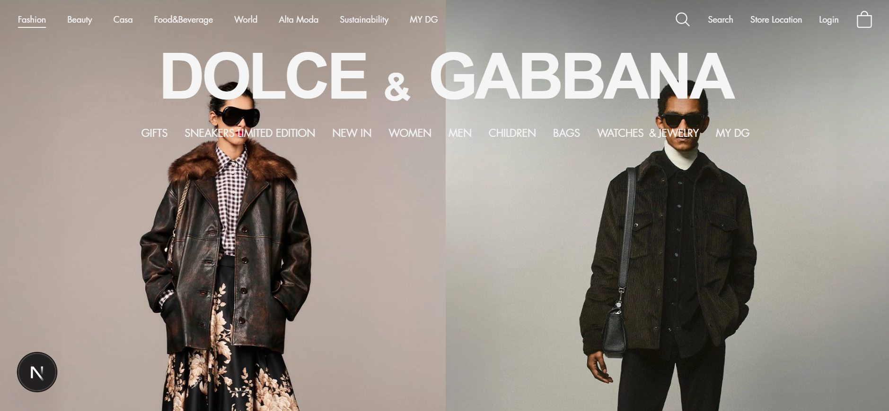

# Dolce & Gabbana Landing Page Clone

A high-fidelity, responsive clone of the official Dolce & Gabbana landing page, built with modern web technologies to achieve a pixel-perfect and performant user experience.

 <!-- Replace with a path to your actual screenshot -->


---


## Overview

This project is a front-end replication of the Dolce & Gabbana luxury fashion website's landing page. The goal was to meticulously recreate the visual design, layout, and interactive elements while adhering to modern development best practices. The site is fully responsive, ensuring a seamless experience across all device sizes, from desktop to mobile.

**Disclaimer:** This is a personal learning project and is not affiliated with, endorsed by, or connected to Dolce & Gabbana in any way. All brand assets and designs are the property of their respective owners and are used here for educational purposes only.

## ✨ Features

- **Pixel-Perfect UI:** Faithful recreation of the original Dolce & Gabbana design, including typography, colors, and spacing.
- **Full Responsiveness:** Optimized layout for desktop, tablet, and mobile devices using Tailwind CSS.
- **High Performance:** Built with Next.js 13+ (App Router) for server-side rendering (SSR), static generation, and fast page loads.
- **Smooth Animations:** Elegant micro-interactions and transitions using Framer Motion for a premium feel.
- **Interactive Components:** Functional navigation menu, image galleries, and hover effects.
- **SEO-Friendly:** Proper meta tags, semantic HTML, and a clean structure for better search engine visibility.

## 🛠 Tech Stack

- **Framework:** [Next.js 14](https://nextjs.org/) (App Router)
- **Styling:** [Tailwind CSS](https://tailwindcss.com/)

### Installation

1. **Clone the repository**
    ```bash
    git clone https://github.com/dilawrenzo77/Dolce-Gabbana-Landing-Clone.git
    cd exness-clone
    ```

2. **Install dependencies**
    ```bash
    npm install
    # or
    yarn install
    ```

3. **Run the development server**
    ```bash
    npm run dev
    # or
    yarn dev
    ```

4. **Open your browser**
    Navigate to [http://localhost:3000](http://localhost:3000) to view the project.

    <br/>

# 🙏 Acknowledgements


- Dolce & Gabbana: For the original design inspiration. This is a fan-made clone for portfolio purposes.